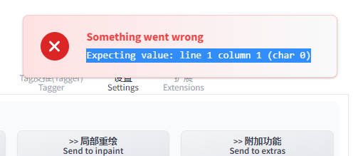

# 前提准备


安装 python  请至 [Python官网](https://www.python.org/downloads/release/python-3106/)下载的64位安装文件。`3.10.6``Python 3.10.6`,安装前务必勾选，将Python加到环境变量。 再按。`Add Python 3.10 to PATH``Install Now`


=======


安装 git  [Git for Windows](https://gitforwindows.org/) 下载安装文件，一直下一步即可。

下载 安装显卡驱动程序

Nvidia显示卡建议用 [Geforce Experience](https://www.nvidia.com/zh-tw/geforce/geforce-experience/)安装最新驱动，会顺便安装CUDA。 或者你想 [手动下载CUDA](https://developer.nvidia.com/cuda-downloads)也行。

AMD显示卡请用 [驱动程序自动检测工具](https://www.amd.com/zh-hant/support/kb/faq/gpu-131)安装显卡驱动。

Intel Arc显卡请安装 [WHQL](https://www.intel.com.tw/content/www/tw/zh/download/726609/intel-arc-iris-xe-graphics-whql-windows.html)驱动。

参考下载版本：

方法一： win+R打开cmd，输入nvidia-smi，查看自己显卡对应的cudb版本


## 检查

输入以下指令，检查目前Python版本，输出应为3.10.6

python 指定下载源

```
[global]
index-url = https://pypi.tuna.tsinghua.edu.cn/simple

[install]
trusted-host=mirrors.aliyun.com
```


```bash
python --version
```

Nvidia显示卡用户输入以下指令，确认CUDA是否有正确安装，输出应含有`nvcc: NVIDIA (R) Cuda compiler driver`

```bash
nvcc --version
```

Nvidia显卡用户输入以下指令，复制Stable Diffusion WebUI的储存库。 复制完成后保持终端机开着。

```bash
git clone https://github.com/AUTOMATIC1111/stable-diffusion-webui.git
```

AMD显卡用户请用这个DirectML的分支：

```bash
git clone https://github.com/lshqqytiger/stable-diffusion-webui-directml.git
```

Intel Arc显卡用户请用这个DirectML的分支：

```bash
git clone https://github.com/Aloereed/stable-diffusion-webui-arc-directml.git
```

复制完成储存库后，桌面会多出文件夹。 如果你有下载模型，将刚刚下载的存档点模型放到文件夹。 这个文件夹可放入多个存档点模型文件。`stable-diffusion-webui``models/Stable-diffusion`


=======
## 设定启动命令行参数

如下图所示，对文件夹里面的按右键，以记事本打开（看不到.bat请点击文件管理视图 → 显示/隐藏 → 显示扩展名）`stable-diffusion-webui``webui-user.bat`


接着您想要编辑这一行启动参数。`set COMMANDLINE_ARGS=`

若显卡VRAM在8GB以上，将替换成引数。`set COMMANDLINE_ARGS=``set COMMANDLINE_ARGS=--enable-insecure-extension-access`

显示卡VRAM小于等于4GB，将替换成引数。 加上的用意是为了限制VRAM占用。`set COMMANDLINE_ARGS=``set COMMANDLINE_ARGS=--medvram --opt-split-attention --enable-insecure-extension-access``--medvram`

电脑RAM（不是VRAM）小于等于8GB的话改替换为参数。 注意使用引数会让高阶显卡算图变很慢。`set COMMANDLINE_ARGS=--lowvram --opt-split-attention --enable-insecure-extension-access``--lowvram`

（下面的不加也可以）

加上可进一步减少VRAM占用，只支持Nvidia显卡。 加入减少使用VAE算出黑图的机率。`--xformers``--no-half-vae`

加上引数再开放防火墙7860串埠，即可用区域网络其他电脑的浏览器访问WebUI。`--listen`

加上引数则会产生一组Gradio网址，让你可以从外部网络或手机使用WebUI。 网址72小时后过期。`--share`

其余可用引数请见 [命令列引数](https://ivonblog.com/posts/stable-diffusion-webui-manuals/installation/command-line-arguments-and-settings/)

```
set COMMANDLINE_ARGS=--enable-insecure-extension-access  --xformers --no-half-vae --no-gradio-queue 

```

## 遇到问题

启动后：


github上issue  https://github.com/AUTOMATIC1111/stable-diffusion-webui/issues/9150

我是参考的这个

> > 同样的问题，这个有效果，但是有没有其他方法可以启动代理？我试着添加`set COMMANDLINE ARGS=--share`到webui-user.bat文件，但是没有用
>
> 我遇到了同样的问题。如果你不想关闭代理，你可以在命令参数中添加 --no-gradio-queue 作为[#9132 (comment)](https://github.com/AUTOMATIC1111/stable-diffusion-webui/issues/9132#issuecomment-1488638956)中提到的解决方法，它对我有用。

我这边遇到同样的问题，加上上面描述的指令后，正常了




# 启动Stable Diffusion WebUI

初次启动会下载好几GB的资料，请保持网路顺畅，不要开VPN。如果您所在的地方有网路审查干扰Github连线，请想办法找代理绕过。

回到终端机，输入以下指令启动SD WebUI：

```
cd stable-diffusion-webui
./webui-user.bat
```


初次启动会下载依赖套件，大概要等个30分钟安装。如果在此步骤遇到错误，请先看 [常见问题](https://ivonblog.com/posts/stable-diffusion-webui-manuals/installation/errors/)。


启动完成后会显示一组网址。执行程式时请勿关闭终端机。


用浏览器开启：`http://127.0.0.1:7860`就可进入图形界面了。执行程式时请勿关闭终端机，执行时若出错终端机也会输出讯息。


要关闭SD WebUI，在终端机按Ctrl+C终止，再关闭视窗。日后要启动SD WebUI，只要对资料夹里面的`webui-user.bat`按二下即可(不需要用系统管理员执行)。


目录结构：


# 模型下載網站

目前找Stable Diffusion与其衍生模型的网站主要就二个。

第一个是 [HuggingFace](https://huggingface.co/models?other=stable-diffusion)，中文俗称抱脸笑，可以说是人工智能界的Github。 Stable Diffusion背后用到的很多AI工具，如Transformer、Tokenizers、Datasets都他们开发的，网站上也有丰富的教学文档。

另一个是 [Civitai](https://civitai.com/)，专门用来分享Stable Diffusion相关的资源，特色是模型都有示范缩图，用户也可以分享彼此使用的提示词，以及分享作品。


# 文生图


# 补充功能

## 汉化

- 正体中文扩充功能来源： [benlisquare/stable-diffusion-webui-localization-zh_TW](https://github.com/benlisquare/stable-diffusion-webui-localization-zh_TW)
- 简体中文扩充功能来源： [dtlnor/stable-diffusion-webui-localization-zh_CN](https://github.com/dtlnor/stable-diffusion-webui-localization-zh_CN)

Stable Diffusion WebUI可以透过扩充功能将界面变成中文。如果您想协助翻译，请点选以上的Github储存库连结，帮帮他们。

- 进入Extensions页面，取消勾选`localization`，再点选`Load from:`，找到`zh_TW Localization`或`zh_CN Localization`，点选Install。

之后重启WebUI，界面就会变成中文了。

由于SD WebUI的扩充功能发展太快，翻译可能跟不上，建议另外安装双语对照 [sd-webui-bilingual-localization](https://github.com/journey-ad/sd-webui-bilingual-localization)，同时显示中文和英文的文字，这样看教学时就不会找无按钮了。

双语扩充功能安装方法：在Extensions页面按`Install from URL`，填入`https://github.com/journey-ad/sd-webui-bilingual-localization`，再按`Install`。


- 到Settings页面，找到左边的Localization，点选`zh-tw`或`zh-cn`，再点选`Apply Settings`。 之后重启WebUI，界面就会变成中文了。


- 由于SD WebUI的扩充功能发展太快，翻译可能跟不上，建议另外安装双语对照 [sd-webui-bilingual-localization](https://github.com/journey-ad/sd-webui-bilingual-localization)，同时显示中文和英文的文字，这样看教学时就不会找无按钮了。双语扩充功能安装方法：在Extensions页面按`Install from URL`，填入`https://github.com/journey-ad/sd-webui-bilingual-localization`，再按`Install`。
- 在启用双语扩充功能前，要到Settings → User interface → Localization设为None再重启WebUI才会生效。


## 安装扩充功能

注意：安装扩充功能可能会导致Stable Diffusion WebUI无法启动，或是启动变慢。

如果遇到bug，您应当优先到扩充功能开发者的储存库回报，而非直接到AUTOMATIC1111的储存库询问。

- 用图形界面安装

  您必须在 [命令列引数](https://ivonblog.com/posts/stable-diffusion-webui-manuals/installation/command-line-arguments-and-settings/)加入`--enable-insecure-extension-access`才能从图形界面装扩充功能。

​    最简单的方法就是点选Extensions → Available的`Load from:`，就会列出可下载安装的扩充功能，点选安装。


有些比较新的扩充功能则是要您复制Github储存库网址，并点选选Extensions → `Install from URL`，贴上网址再按Install，它会自动完成git clone的操作。

在安装扩充功能后，都要点选Installed → Apply and restart WebU，重新载入网页界面。有些则是得关掉终端机，重新启动WebUI。

如果未来要更新扩充功能，点选Installed → Check for updates，等待下载完成，然后重启WebUI。您可以在这个界面按取消打勾来停用特定的扩充功能。

- 用指令安装

Stable Diffusion WebUI的扩充功能目录一律放在`extensions`资料夹。

1. 用指令安装扩充功能前先关闭主程式。

2. 接着在`stable-diffusion-webui/extensions`资料夹开启终端机，执行`git clone`指令，安装扩充功能。例如要安装正体中文翻译的话就是把该储存库复制下来：

   ```bash
   git clone https://github.com/benlisquare/stable-diffusion-webui-localization-zh_TW.git
   ```


3. 重新启动SD WebUI，即会看到新安装的扩充功能。

​          未来要一次更新全部扩充功能的话，在`stable-diffusion-webui/extensions`资料夹开启终端机，执行以下指令：

```bash
# Linux
ls | xargs -I{} git -C {} pull

# Windows
Get-ChildItem | ForEach-Object { git -C $_.FullName pull }
```

- 如何移除扩充功能

1. 关闭Stable Diffusion WebUI的终端机。
2. 到`stable-diffusion-webui`下的`extension`资料夹，将要移除的扩充功能资料夹删除。
3. 如果要完全移除扩充功能，将`stable-diffusion-webui`下的`venv`资料夹也删除，迫使主程式下次启动重新安装pip依赖套件。

## ControlNet 按照骨架画图

- 插件安装来源： [Mikubill/sd-webui-controlnet](https://github.com/Mikubill/sd-webui-controlnet) 
- ControlNet的储存库： [lllyasviel/ControlNet](https://github.com/lllyasviel/ControlNet)

目前版本：ControlNet v1.1

ControlNet是通过加入额外条件来控制扩散模型的神经网路结构，它可以让AI参考给定图片的动作/线条/景深，更精准的生成图片。

跟内建的「图生图」技术比起来，ControlNet的效果更好，能让AI以指定动作生图；再搭配3D建模作为辅助，能缓解单纯用文生图手脚、脸部表情画不好的问题。

ControlNet的用法还有：上传人体骨架线条，ControlNet就能按骨架的动作生成完稿的人物图片。或是上传素色的3D建模，让ControlNet彩现成为室内布置家具。

Lvmin Zhang是ControlNet原始程式的开发者，Mikubill则是开发扩充功能，让我们可以在Stable Diffusion WebUI用ControlNet生图。


ControlNet模型下载huggingface：https://huggingface.co/Hetaneko/Controlnet-models/tree/main/controlnet_safetensors 

### 安装ControlNet与下载模型 [#](https://ivonblog.com/posts/stable-diffusion-webui-manuals/extensions/controlnet/#1-安裝controlnet與下載模型)

1. 切换至Extensions页面，点选`Install From URL`，URL输入`https://github.com/Mikubill/sd-webui-controlnet.git`，按下Install，接着从终端机按CTRL＋C，关闭Stable Diffusion WebUI。
2. 到 [lllyasviel/ControlNet v1.1](https://huggingface.co/lllyasviel/ControlNet-v1-1/tree/main)下载以`.pth`结尾的模型档，全部档案加起来约18GB。`.yaml`档不需要下载。目前v1.1是测试版，之后会合并回 [主储存库](https://huggingface.co/lllyasviel/ControlNet)。

   

3. 将这些模型档放到`stable-diffusion-webui/extensions/sd-webui-controlnet/models`资料
4. 重新启动Stable Diffusion WebUI。

### 各个模型的用途

ControlNet现有以下模型，您可以按照需求只下载需要的模型。

-  Anime Lineart

侦测线条，生成的图片亦会保留原始的线条，适合处理动漫图像

- Canny

侦测图片边缘，比较模糊，不如Scribbles完整。

-    Depth

侦测输入图片的深度图(depth map)。

- Illumination

侦测输入图片的光源与照明效果。

- Inpaint

功能类似「内补绘制」，使用50%随机遮罩＋50%随机光流遮罩训练而成。

- Instruct Pix2Pix

模型档名为`ip2p`，类似「图生图」，但是使用训练50%的指示(instruction)提示词和50%的叙述(description)提示词训练而成。因为是ControlNet，使用此模型时不需要调整CFG Scale。

根据原作者的说法，此模型在下「使其成为X」的提示词所生成的图，效果比「使Y成为X」要好。

> Also, it seems that instructions like “make it into X” works better than “make Y into X”.

- Lineart

侦测线条，适合处理线稿，生成的图片亦会保留原始的线条。

- M-LSD

侦测输入图片的直线。

- Normalbae

- Openpose

使用OpenPose技术侦测输入图片人物的动作，不一定会保留线条。

- Scribbles

侦测线条，侦测到的线条品质介于Soft Edge和Lineart之间。

- Segmentation

模型档名为`seg`，将侦测的图片物件切成一个一个色块处理，例如房子一个色块，后面的天空一个色块。

- Shuffle

把输入图片的概念转移到生成的图片。

- Soft Edge

侦测图片边缘，效果较为柔和，像用炭笔涂过。

- Tile

输入图片，选取一个区域，使其变清晰的模型。

### 参数解说

在安装之后，WebUI的界面会多出"ControlNet"的按钮。


点开会看到以下选项：

#### Single Image [#](https://ivonblog.com/posts/stable-diffusion-webui-manuals/extensions/controlnet/#single-image)

上传单张图片。

#### Batch [#](https://ivonblog.com/posts/stable-diffusion-webui-manuals/extensions/controlnet/#batch)

处理多张图片。Input Directory填写的是待处理的图片所在路径。

#### Open New Canvas [#](https://ivonblog.com/posts/stable-diffusion-webui-manuals/extensions/controlnet/#open-new-canvas)

清除图片，开一张新画布。

#### 使用电脑镜头 [#](https://ivonblog.com/posts/stable-diffusion-webui-manuals/extensions/controlnet/#使用電腦鏡頭)

在Open New Canvas的选项下面有四个按钮。


由左到右：新增画布；使用电脑镜头拍照上传；未知；还原上次算图设定。

#### Enable [#](https://ivonblog.com/posts/stable-diffusion-webui-manuals/extensions/controlnet/#enable)

在生图时启用ControlNet，必选。

#### Low VRAM [#](https://ivonblog.com/posts/stable-diffusion-webui-manuals/extensions/controlnet/#low-vram)

生图使用ControlNet会吃更多VRAM，此选项可降低VRAM使用量。

#### Pixel Perfect [#](https://ivonblog.com/posts/stable-diffusion-webui-manuals/extensions/controlnet/#pixel-perfect)

由ControlNet自动决定Preprocessor解析度。

#### Allow Preview [#](https://ivonblog.com/posts/stable-diffusion-webui-manuals/extensions/controlnet/#allow-preview)

允许预览生图结果，会显示该模型侦测的线条或骨架。

#### Preprocessor 预处理器 [#](https://ivonblog.com/posts/stable-diffusion-webui-manuals/extensions/controlnet/#preprocessor-預處理器)

通常Preprocessor和Model二者要一致。

Preprocessor是先将上传的图片处理过一轮，例如`Scribbles`会将彩色图片转成线稿。若图片的线条是白底黑线，且不是用WebUI画布所绘制，则Preprocessor必须选取"Invert"。

如果你的图片不需要处理，Preprocessor可留空。

#### Run Preprocessor (爆炸图示) [#](https://ivonblog.com/posts/stable-diffusion-webui-manuals/extensions/controlnet/#run-preprocessor-爆炸圖示)

执行预处理器，预先处理图片。

#### Model 模型 [#](https://ivonblog.com/posts/stable-diffusion-webui-manuals/extensions/controlnet/#model-模型)

设定生图的时候使用哪个ControlNet模型。

#### Control Weight [#](https://ivonblog.com/posts/stable-diffusion-webui-manuals/extensions/controlnet/#control-weight)

ControlNet在生图时的权重。

#### Starting Control Step [#](https://ivonblog.com/posts/stable-diffusion-webui-manuals/extensions/controlnet/#starting-control-step)

要让ControlNet开始参与生图的步数。

#### Ending Control Step [#](https://ivonblog.com/posts/stable-diffusion-webui-manuals/extensions/controlnet/#ending-control-step)

让ControlNet结束参与生图的步数。

#### Preprocessor Resolution [#](https://ivonblog.com/posts/stable-diffusion-webui-manuals/extensions/controlnet/#preprocessor-resolution)

预处理器的解析度。

如果不知道要设多少，请勾选"Pixel Perfect"让ControlNet自动为您决定。

#### Control Mode (Guess Mode) [#](https://ivonblog.com/posts/stable-diffusion-webui-manuals/extensions/controlnet/#control-mode-guess-mode)

控制生图时，要AI平衡二者(Balanced)，或是偏重你的提示词(My prompt is more important)，还是偏重ControlNet (ControlNet is more important)。

#### [Loopback] Automatically send generated images to this ControlNet unit [#](https://ivonblog.com/posts/stable-diffusion-webui-manuals/extensions/controlnet/#loopback-automatically-send-generated-images-to-this-controlnet-unit)

自动将生成的图片传回此ControlNet运算单元(unit)。

是的，如果您的电脑VRAM够大，您可以在Settings → ControlNet启用多个ControlNet运算单元。

#### Multi ControlNet [#](https://ivonblog.com/posts/stable-diffusion-webui-manuals/extensions/controlnet/#multi-controlnet)

一个ControlNet效果不够，您有没有想过启用第二、第三个ControlNet！？

预设安装后只会使用一个ControlNet，但是叠加多个有助于生成更好的图片。比方说同时使用Open Pose和Depth生成人体，并防止手画歪。

要启用Multi ControlNet，请进入Settings → ControlNet，拖动拉杆，设定要启用的ControlNet数量。


### 实际操作 [#](https://ivonblog.com/posts/stable-diffusion-webui-manuals/extensions/controlnet/#4-實際操作)

此处以改绘一个人物姿势为例子。

1. 在安装之后，WebUI的界面会多出"ControlNet"的按钮。


1. 进入文生图的页面填入提示词，接着点开下面ControlNet的界面，勾选`Enabled`启用ControlNet，上传图片。勾选LowVRAM可降低VRAM占用。


1. 接着选取要使用的Preprocessor和Model，二者要一致。

Preprocessor是先将上传的图片处理过一轮，例如`Scribbles`会将彩色图片转成线稿。如果你的图片不需要处理，则Preprocessor可留空。


1. 以Scribbles为例，选取后点选右上角Generate即会生成出结果，并附上侦测到的线条。如下图所示，右边贞德的姿势确实跟左边的02十分类似。


##  提示词自动补齐

- 扩充功能来源： [DominikDoom/a1111-sd-webui-tagcomplete](https://github.com/DominikDoom/a1111-sd-webui-tagcomplete)

输入提示词的时候提示相关Danbooru上的标签，画动漫图的时候很有用，还可以安装中文标签翻译


进入Extensions页面，点选`Install from URL`，输入网址`https://github.com/DominikDoom/a1111-sd-webui-tagcomplete.git`，按`Install`，之后重启WebUI。

如何安装标签中文翻译：到 [byzod/a1111-sd-webui-tagcomplete-CN](https://github.com/byzod/a1111-sd-webui-tagcomplete-CN)储存库，点选绿色的Code → Download ZIP，解压缩，得到tags资料夹，下面有`Tags-zh-full-pack.csv`和`config.json`这二个档案。将这二个档案移动到`stable-diffusion-webui/extensions/a1111-sd-webui-tagcomplete/tags`资料夹。


## 图片库浏览器 Image Browser

- 扩充功能来源： [yfszzx/stable-diffusion-webui-images-browser](https://github.com/yfszzx/stable-diffusion-webui-images-browser)

安装后即可方便浏览生图的结果，并查看使用过的提示词历史纪录。

安装方法：进入Extensions页面，点选Install from URL，输入`https://github.com/yfszzx/stable-diffusion-webui-images-browser.git`后按Install，重启WebUI。WebUI页面即会多出"Images Browser"的页面。

点进去，按一下First Page即会显示最近生图的结果。


点选单张图片，查看使用过的提示词，还可以给予星级评分。


## 图片生成预览

插件地址

https://github.com/zanllp/sd-webui-infinite-image-browsing

## mov2mov

- 扩充功能来源： [Scholar01/sd-webui-mov2mov](https://github.com/Scholar01/sd-webui-mov2mov)

＊需要先安装ControlNet才能使用这个扩充功能。

将影片逐一抽出画格，使用ControlNet生图，然后再自

动合成新影片。可以设定输出的画格率，将人物单独处理。

切换到mov2mov页面，输入提示词, 再上传影片。


在下面设定输出影片的长宽。生图的长宽比例应与原始影片一致。


最下面是单独用ControlNet处理人物的选项，可以改善动作侦测的精度。


点选右上角Generate，即会开始生成。成品位于主程式下的`/outputs/mov2mov-images`目录。


## 监控系统

- 扩充功能来源： [vladmandic/sd-extension-system-info](https://github.com/vladmandic/sd-extension-system-info)

此扩充功能给Stable Diffusion WebUI新增一个监控系统信息的页面，显示主程序版本、系统信息、GPU、RAM、使用的模型、使用的命令列参数等等。


点击下面的Run benchmark可以跑分测试系统性能，有助于评估主程序更新后性能是否有变化。 点击Submit results将结果回报到 [Vladimir Mandic的网站](https://vladmandic.github.io/sd-extension-system-info/pages/benchmark.html)。


## 骨架人偶

- 扩充功能来源： [hnmr293/posex](https://github.com/hnmr293/posex)

＊需要先安装ControlNet才能使用这个扩充功能。

PoseX是可以在Stable Diffuison WebUI直接拉人物骨架，再配合ControlNet生成姿势的扩充功能。

类似的扩充功能为 [OpenPose Editor](https://github.com/fkunn1326/openpose-editor)，差别在于PoseX可以旋转放大。

1. 切换至Extensions页面，点选Install From URL，URL输入`https://github.com/hnmr293/posex.git`，按下Install。接着重启WebUI。
2. 开启文生图的页面，点选右下角PoseX，点选Send this image to ControlNet
3. 在下面的ControlNet，点选Enabled，preprocessor选取`none`，model选`openpose`，不需要上传图片。
4. 回到上面的PoseX，调整人物姿势。左键点选移动，滚轮放大缩小，对模型左键点二下即可用右键移动单个骨架。
5. 填入正负向提示词，即会按照PoseX的姿势来生成图片。


##  face editor

sd的面部编辑器。它可用于修复由 Stable Diffusion 生成的图像中的破损面孔。

这是[AUTOMATIC1111 的 Stable Diffusion Web UI](https://github.com/AUTOMATIC1111/stable-diffusion-webui)的[扩展](https://github.com/AUTOMATIC1111/stable-diffusion-webui/wiki/Extensions)。

该软件改进了这些特征中的面部图像：

- txt2img
- img2img
- 批处理（批次计数/批次大小）
- img2img批处理


1. 打开“扩展”选项卡，然后打开“从 URL 安装”选项卡。
2. 在“扩展的 git 存储库的 URL”字段中 输入“ [https://github.com/ototadana/sd-face-editor.git ”。](https://github.com/ototadana/sd-face-editor.git)

https://github.com/ototadana/sd-face-editor


## Multidifussion-upscaler扩展


https://github.com/pkuliyi2015/multidiffusion-upscaler-for-automatic1111/blob/main/README_CN.md


Prompt-all-in-one：https://gitcode.net/ranting8323/sd-webui-prompt-all-in-one  提示词


Canvas-zoom：https://github.com/richrobber2/canvas-zoom  解决图生图的画图绘的放大比例问题


# 内建功能

## 文生图

文生图(txt2image)即为让AI按照文字叙述生图。

开启Stable Diffusion WebUI网页后，第一个看到的是以下画面，这就是文生图的页面。生图流程为在左上角填入提示词，勾选左下角的生图参数，再点选右上角生成图片。其余SD WebUI的功能用法大抵都按照此逻辑设计，有些参数是通用的。

### 参数解说

- Stable Diffusion checkpoint [#](https://ivonblog.com/posts/stable-diffusion-webui-manuals/features/text-to-image/#stable-diffusion-checkpoint)

目前使用的存档点模型。

- Prompts 提示词 [#](https://ivonblog.com/posts/stable-diffusion-webui-manuals/features/text-to-image/#prompts-提示詞)

这是填入正向与负向提示词的栏位。

- Sampling Methods 取样方法 [#](https://ivonblog.com/posts/stable-diffusion-webui-manuals/features/text-to-image/#sampling-methods-取樣方法)

Sampling Methods即为取样方法，各种方法得出的结果不太一样。

UniPC是2023年发表的取样方法。

DDIM和PLMS是2022年随Stable Diffusion v1发表的取样方法。

若要兼顾品质与速度，请优先试试这三种取样方法：UniPC、DPM++ 2M Karras、Euler a。

- Sampling Steps 取样步数 [#](https://ivonblog.com/posts/stable-diffusion-webui-manuals/features/text-to-image/#sampling-steps-取樣步數)

取样步数建议值至少为20，在使用Euler a和UniPC取样方法的时候就有很好效果。

相对的DDIM需要80以上的取样步数才会有好结果。

- Restore faces 脸部修复 [#](https://ivonblog.com/posts/stable-diffusion-webui-manuals/features/text-to-image/#restore-faces-臉部修復)

使用脸部修复模型改善脸部生成效果。预设使用CodeFormer，可在Settings切换为GFPGAN。

- Tiling 平铺 [#](https://ivonblog.com/posts/stable-diffusion-webui-manuals/features/text-to-image/#tiling-平鋪)

生成类似地板花纹一样可连续的图片。

- Hires_fix 高画质修复 [#](https://ivonblog.com/posts/stable-diffusion-webui-manuals/features/text-to-image/#hires_fix-高畫質修復)

可以提升图片的画质，但是会耗费更多VRAM。

- Upscaler [#](https://ivonblog.com/posts/stable-diffusion-webui-manuals/features/text-to-image/#upscaler)

要使用的放大器。

- Hires steps [#](https://ivonblog.com/posts/stable-diffusion-webui-manuals/features/text-to-image/#hires-steps)

高画质修复步数。

- Denoising strength [#](https://ivonblog.com/posts/stable-diffusion-webui-manuals/features/text-to-image/#denoising-strength)

降噪强度。

- Upscale by [#](https://ivonblog.com/posts/stable-diffusion-webui-manuals/features/text-to-image/#upscale-by)

缩放系数。

- Width x Height 图片宽高 [#](https://ivonblog.com/posts/stable-diffusion-webui-manuals/features/text-to-image/#width-x-height-圖片寬高)

生成图片的宽高，尺寸越大品质越好，但越会吃掉更多VRAM。

预设宽高为512x512，新版的建议可以试试768x768。

其余可用的宽高比(ratio)请参考下表。 [图片来源](https://github.com/AUTOMATIC1111/stable-diffusion-webui/discussions/1025#discussioncomment-3727588)


- CFG Scale [#](https://ivonblog.com/posts/stable-diffusion-webui-manuals/features/text-to-image/#cfg-scale)

CFG Scale即Classifier-free guidance scale

AI生图与你给的提示词的相关度，数值越高越会按照你说的内容下去生图。

- Batch count [#](https://ivonblog.com/posts/stable-diffusion-webui-manuals/features/text-to-image/#batch-count)

设定按左上角的Generate后要生成多少次的图片。

- Batch size [#](https://ivonblog.com/posts/stable-diffusion-webui-manuals/features/text-to-image/#batch-size)

设定按左上角的Generate后，一次生成内要算多少图片。通常要一次算多张图，调整Batch count就够了，Batch size的值维持为1。

- Seed 种子码 [#](https://ivonblog.com/posts/stable-diffusion-webui-manuals/features/text-to-image/#seed-種子碼)

生成图片的种子码。将种子码保存下来有助于保留生图的风格。

点选骰子图示，设定成`-1`即为重置种子码；回收符号则是叫出上一次生图所使用的种子码。

- Seeds Extra [#](https://ivonblog.com/posts/stable-diffusion-webui-manuals/features/text-to-image/#seeds-extra)

测试更多种子码变化之用。

- Variation seed [#](https://ivonblog.com/posts/stable-diffusion-webui-manuals/features/text-to-image/#variation-seed)

- Variation strength [#](https://ivonblog.com/posts/stable-diffusion-webui-manuals/features/text-to-image/#variation-strength)

变化强度，此值越高，生图结果越不可预料。

- Resize seed from width [#](https://ivonblog.com/posts/stable-diffusion-webui-manuals/features/text-to-image/#resize-seed-from-width)

- Resize seed from height [#](https://ivonblog.com/posts/stable-diffusion-webui-manuals/features/text-to-image/#resize-seed-from-height)

- Scripts [#](https://ivonblog.com/posts/stable-diffusion-webui-manuals/features/text-to-image/#scripts)

载入使用者撰写的指令稿。内建的有：

- Prompt Matrix：会生出一个表格图片，用于比对不同提示词生图的效果
- Prompts from files or textbox：从写好提示词的档案生成图片。
- X/Y/Z plot：用于比对不同提示词、取样方法、CFG Scale、种子码的组合所生图的效果。

### 采样方式

```


**Sampler（采样器/采样方法）** 选择使用哪种采样器。 Euler a（Eular ancestral）可以以较少的步数产生很大的多样性，不同的步数可能有不同的结果。而非 ancestral 采样器都会产生基本相同的图像。DPM 相关的采样器通常具有不错的效果，但耗时也会相应增加。

- - Euler 是最简单、最快的
  - Euler a 更多样，不同步数可以生产出不同的图片。但是太高步数 (>30) 效果不会更好。
  - DDIM 收敛快，但效率相对较低，因为需要很多 step 才能获得好的结果，适合在重绘时候使用。
  - LMS 是 Euler 的衍生，它们使用一种相关但稍有不同的方法（平均过去的几个步骤以提高准确性）。大概 30 step 可以得到稳定结果
  - PLMS 是 Euler 的衍生，可以更好地处理神经网络结构中的奇异性。
  - DPM2 是一种神奇的方法，它旨在改进 DDIM，减少步骤以获得良好的结果。它需要每一步运行两次去噪，它的速度大约是 DDIM 的两倍，生图效果也非常好。但是如果你在进行调试提示词的实验，这个采样器可能会有点慢了。
  - UniPC 效果较好且速度非常快，对平面、卡通的表现较好，推荐使用
```


### 储存提示词

右上角可以储存与载入生图提示词。

5个按钮由左至依序为：1. 叫出上次生图使用的设定值2. 清空提示词3. 启用 [额外网路](https://ivonblog.com/posts/stable-diffusion-webui-manuals/features/extra-networks/)4. 套用选中的风格5. 储存目前的提示词

储存的提示词此处称为风格(styles)

下方的Styles列表即为储存的提示词。点选储存的提示词(可多选)，再点选上面的剪贴板图示，即会将该提示词组合加到左边的提示词栏位。

# 图片预览开启

到设置中开启


## 图生图

图生图(img2img)是让AI参照现有的图片生图，源自InstructPix2Pix技术。

例如：上传一张真人照片，让AI把他改绘成动漫人物；上传画作线稿，让AI自动上色；上传一张黑白照，让AI把它修复成彩色相片。

这个功能位于「Img2img」的页签。

### 参数解说

部份参数与文生图的参数重叠，这里不赘述。

- Resize mode 裁切模式 [#](https://ivonblog.com/posts/stable-diffusion-webui-manuals/features/image-to-image/#resize-mode-裁切模式)

决定要对上传的图片做何种操作。

上传的图片最好与生图设定的一致。

- Just resize：调整图片为生图设定的宽高。若上传图片的宽高与生成设定的宽高不一致，则该图片会被压扁
- Crop and resize：裁切图片以符合生图的宽高
- Resize and fill：裁切并调整图片宽高，若上传图片的宽高与生成设定的宽高不一致，则多出来的区域会自动填满。
- Just resize (latent upscale)：调整图片大小为生图设定的宽高，并使用潜在空间放大。

- Resize to [#](https://ivonblog.com/posts/stable-diffusion-webui-manuals/features/image-to-image/#resize-to)

依照填入的宽高来生图。

- Resize by [#](https://ivonblog.com/posts/stable-diffusion-webui-manuals/features/image-to-image/#resize-by)

依照填入的缩放系数来生图，然后缩放图片。

- Denoising strength 降噪强度 [#](https://ivonblog.com/posts/stable-diffusion-webui-manuals/features/image-to-image/#denoising-strength-降噪強度)

数值越小，生成的图与原图越相似，可用来微调图片。

- Interrogate Deepboooru [#](https://ivonblog.com/posts/stable-diffusion-webui-manuals/features/image-to-image/#interrogate-deepboooru)

上传图片后，用Danbooru图库资料判别图片并自动填入提示词。需要注意Deepboooru训练的图像数量有限，它顶多只能用来认图片的场景和人物tag，无法准确标出最新的动漫角色。


初次使用的时候，Stable Diffusion WebUI会自动下载模型。

- Interrogate CLIP [#](https://ivonblog.com/posts/stable-diffusion-webui-manuals/features/image-to-image/#interrogate-clip)

类似Deepbooru用途，不过较适合判别真人照片内容。

## 内补绘图

内补绘制(inpaint)。这是用AI填充涂黑(遮罩)区域的技术，例如给图片的角色换衣服。或是反过来：让AI把图片空白的地方绘制完成(outpaint)。

可以想像成让AI帮您修图，用于在图中新增或去除物件。

此功能位于Img2img下的Inpaint页面。


### 参数解说

- Mask blur

图片上的笔刷毛边柔和程度。

- Mask mode

选择要让AI填满涂黑区域(Inpaint masked)，或是填满未涂黑区域(Inpaint not masked)。

- Masked content

要填充的内容。

- Fill：让AI参考涂黑附近的颜色填满区域。
- Original：在填满区域的时候参考原图底下的内容。
- latent noise：使用潜在空间填满，可能会生出跟原图完全不相关的内容。
- latent nothing：使用潜在空间填满，不加入噪声。

- Inpaint area

选择要填满整张图片(Whole picture)或是只填满涂黑的区域(Only masked)

`Only masked padding, pixels`是像素内距。

Only masked即外补绘制模式。

### 实际操作

1. 上传图片，点选图片，用滑鼠将要替换的部份涂黑。
2. 或者也可以切换到Inpaint Upload页面，上传图片，再于下方Mask上传涂好遮罩的图片。
3. 假设要换成泳装，那么就在正向提示词加入`swimsuit`或`bikini`这类的提示词。
4. 左下角的`Masked content`有几个选项：`fill`即为填充新内容，`original`则是在填充内容的时候参考原图黑色底下的内容。点选Generate生图。

若要切换为外补绘制：点选左下角的Mask mode，将`Inpaint masked`改成`Inpaint not masked`，这样AI就会改为填满没有涂黑的地方。

### 批次处理图片

切换到Batch页面


第一个栏位输入要处理的图片路径，例如桌面的`Input`资料夹

第二个则是输出路径

第三个栏位是预先涂好遮罩的图片的路径


### 额外网路

除了根据需求切换ckpt模型外，也可以额外叠几层网路(Extra networks)小模型来改善画风，并改善生成特定物件、角色的准确度。

例如使用Anything模型生图，再搭配"Taiwan-doll-likeness LoRA"就能转成真人风格而不用依赖许多提示词，并且可以一次叠很多个，就像套多层滤镜一般。


跟ckpt大模型比起来，这类模型档案都很小，主要用来微调现有的模型。小模型有嵌入(Embedding)、超网路(HyperNetwork)、LoRA三种，副档名以`.pt`或`.safetensors`结尾，目前最热门的为"LoRA"。更棒的是因为档案小，自行 [训练喜欢的人物模型](https://ivonblog.com/posts/stable-diffusion-webui-manuals/training/)成本并不高。

###  安装小模型

[Civitai](https://civitai.com/tag/lora)有很多小模型可以下载。下载时需注意模型是哪一种。

Embedding请放`stable-diffusion-webui`资料夹下的`embeddings`

HyperNetwork放到`stable-diffusion-webui/models/hypernetworks`。

LoRA放到`stable-diffusion-webui/models/Lora`。

如果要显示小模型缩图，将图片取跟该模型一样的档名，并放到该模型的资料夹。例如在`Taiwan-doll-likeness.safetensors`所在的资料夹放一张`Taiwan-doll-likeness.png`。

### 小模型使用方法 [#](https://ivonblog.com/posts/stable-diffusion-webui-manuals/features/extra-networks/#2-小模型使用方法)

1. 进入WebUI，点选右上角Show extra networks

   

这样就会出现选单。以LoRA为例，点选小模型的卡片便会将其加到提示词栏位，提示词栏位会出现`< >`，表示要在绘图时使用LoRA。

接着再加上其他提示词，生图即会有使用LoRA的风格。如果生出来的图片太诡异，调整提示词栏位每个LoRA后面的数字，控制权重。


安装与使用VAE

VAE (variational autoencoder)可以让算出来的图片色彩更漂亮，改善图片颜色灰灰暗暗的问题。

Hentai Diffusion这类模型内建VAE，SD WebUI在生图时会自动侦测并套用；Anything这类的模型要另外下载VAE；VAE的下载点通常跟模型下载页面放在一起。

如果要使用VAE，下载VAE模型后，将其放到`stable-diffusion-webui/models/VAE`资料夹。

接着点选Settings → Stabe Diffusion → SD VAE，选取要使用的VAE，再点选Apply Settings，此后生图就会一律使用指定的VAE。

## PNG INFO

SD WebUI生成的图片都是PNG档，并会记载生成图片所使用的模型、提示词等资讯。

如果有人分享未修改过的SD WebUI图片，那么你只要把它下载下来，于此界面上传图片，即会显示该图片背后使用的提示词。

## 放大图像分析

Stable Difussion WebUI内建AI放大技术，像是ESRGAN，比Waifu2x更强。

如果用预设的512x512解析度就生出不错的图，可以将图片直接丢到Extras放大。

###  参数解说

- Scale by

按照此数字的倍数放大

- Scale to

放大至指定宽高

- Upscaler 1 & Upscaler 2

放大图片的时候可以只用一种放大器，也可以混合使用二种放大器。

- Upscaler 2 visibility

第二个放大器的权重。

- GFPGAN visibility

GFPGAN脸部修复模型的权重

- CodeFormer visibility

CodeFormer脸部修复模型的权重

- Upscaler效果比较

目前Stable Diffusion WebUI的放大器包含LDSR、BSRGAN、ESRGAN_4x、R-ESRGAN-General-4xV3、R-ESRGAN-General-WDN-4xV3、R-ESRGAN-AnimeVideo、R-ESRGAN-4x+、R-ESRGAN-4x+-Anime6B、ScuNET-GAN、ScuNET-PSNR、SwinIR_4x…看的让人头昏眼花。

根据Reddit网友在 [The DEFINITIVE Comparison to Upscalers](https://www.reddit.com/r/StableDiffusion/comments/y2mrc2/the_definitive_comparison_to_upscalers/)一文的比较，总结如下：

- ESRGAN_4x适合用于处理真人照片
- ESRGAN_4x适合用于绘画
- Anime6B适合用于动漫图片，它也可以用来将真人图片转动漫风格

###  实际操作

切换至Extras页面，上传图片，选取放大2倍，点选下面的`Upscaler 1`中挑一个看起来顺眼的，其余维持预设，按`Generate`即会得到放大过的图片。


旁边的Batch Process可以一次处理大量图片；Batch from Directory则是从特定资料夹输入放大图片。

## 合并模型

此页面可以将最多三个的存档点模型合并，以融合出更好的效果。


合并模型会占用大量硬碟空间，看用途决定。有时欲生成某个人物，用基础模型搭配LoRA会是比较经济实惠的方法，不必频繁融合模型。


# 训练模型

## 为什么训练模型

本章所讨论的训练模型仅为自用用途，若要分享训练的模型也应遵照开源的原则分享。

为什么要训练自己的模型？训练自己的模型可以在现有模型的基础上，让AI懂得如何更精确生成/生成特定的风格、概念、角色、姿势、物件。

举例来说，如果喂给AI十几张我精挑细选的「Hara老师绘制的、不同角度、FGO的斯卡萨哈」做训练，那么就能让AI更懂得如何生成斯卡萨哈的脸部，风格也会比较固定。

以下是一个具体例子，透过使用自行训练的HyperNetwork，便改善单靠Anything模型无法生成出Hara老师画风的缺点。在不使用HyperNetwork的情况下，风格永远是左边那样；一使用HyperNetwork，右边的风格就能轻松生成出来了。


训练模型是复杂的议题，基于哪个现有模型，以及喂给AI学习的图片品质，还有训练时的参数，都会影响模型训练结果。

本文提及的Embedding、HyperNetwork、LoRA都是「小模型」，这是相对于网路动辄好几GB的checkpoint「大模型」而言。这些小模型训练时间短，档案约几MB而已，训练成本不高。主要是用于生成特定人物/物件/画风，并且训练的模型可以多个混用。

如果硬体条件许可的话，搜集大量图片训练特定领域的checkpoint大模型，再上传到HuggingFace造福他人也是不错的选项，只不过此任务过于庞大。要知道Stable Diffusion 1.5版的模型可是输入了23亿张图片训练出来的！网路上其他人训练的模型至少也准备了几万张图片。因此要生成特定的人物/物件/画风，训练小模型对一般人来说比较划算。

各个模型的原理差异请参考下图。技术原理以及训练参数设定请参阅「参考资料」一章，碍于篇幅无法一一细讲，本章以操作过程为主。

就训练时间与实用度而言，目前应是LoRA > HyperNetwork > Embedding

本章节以AUTOMATIC1111开发的Stable Diffusion WebUI为中心撰写，因其图形化且好操作。后面简称SD WebUI。

接着选择部署在本机或是云端？

训练模型至少需要10GB的VRAM，也就是RTX3060等级以上的GPU。

如果你有Nvidia RTX3060以上等级的GPU，那就参考 [安装教学](https://ivonblog.com/posts/stable-diffusion-webui-manuals/installation/)部署在本机，想训练多久就训练多久。训练资料不到50张图片的小模型训练时间约只要1~3个小时。如果没有强力的GPU，那就用云端训练，例如 [Google Colab](https://ivonblog.com/posts/stable-diffusion-webui-manuals/installation/deploy-to-google-colab/)。


## 准备工作

- 取得高品质图片

训练用的图片最少最少要准备10张。重质不重量。因为我要训练的是单一人物且风格固定，图片不宜有复杂背景以及其他无关人物。

网路图片一张一张右键下载当然可以，不过要大量下载图片的话我会使用 [Imgrd Grabber](https://ivonblog.com/posts/imgbrd-grabber-usage/)或 [Hydrus Network](https://ivonblog.com/posts/setup-hydrus-network/)。


裁切图片

下载图片后，要将训练图片裁切成512x512像素。你可以选择用SD WebUI自动裁切，或是手动裁切。

-  自动裁切

裁切图片不会用到显示卡计算。

1. 将要裁切的图片放到同一个目录下，例如`/home/user/桌面/input`。
2. 开启SD WebUI，进到Train → Preprocess images页面


1. 第一个栏位`Source directory`填写原始图片的路径
2. 第二个栏位`Destination directory`填写输出路径，例如`/home/user/桌面/cropped`
3. Width和Height设定为512x512
4. 点选Preprocess ，图片即会自动裁切。在那之后原始图片就可以删除，只留下裁切后的图片。

- 手动裁切

手动把图片转成512x512理由是避免重要的部分被裁掉。

1. 安装修图软体 [GIMP](https://www.gimp.org/)，点选档案→新增512x512像素的专案


1. 点油漆桶将其漆成白色


1. 将图片拖曳进画面，成为新的图层


1. 点选工具→变形工具→缩放，缩放图片使其符合目前画布大小，再按Enter。


1. 点选档案→Export，汇出成png。


1. 为加快后面图片的处理速度，按右下角删除目前图层，再拖新的图片进来，重复操作。


1. 将33张Hara绘制的斯卡萨哈裁切后，统一放到名为`raw`的目录。


- 预先给图片上提示词 [#](https://ivonblog.com/posts/stable-diffusion-webui-manuals/training/prepare-training-dataset/#3-預先給圖片上提示詞)

接着要给图片预先上提示词，这样AI才知道要学习哪些提示词。

1. 启动SD WebUI，进入Train页面。
2. 进入Preprocess页面，`Source`输入裁切图片的路径，`Destination`填处理后图片输出的路径。


1. 接着勾选`Create Flipped Copies`，建立翻转图片提升训练数量。

然后用Stable Diffusion训练真实图片的勾选`Use BLIP for caption`；训练动漫人物改勾选`Use DeepBooru for caption`。

1. 点选Preprocess，约几分钟后便会处理完成。输出的目录里面会含有每张图片对应的提示词txt档。


1. 点选开启txt档，将你觉得无关的特征都删除，例如`2girls`这类太笼统的提示词。
2. 至此训练资料准备完成。

## 训练EMbeding

Textual Inversion(文本倒置)，又称Embedding(嵌入)，适合让AI学习一个新的概念/物体。画风相较于HyperNetwork学习能力较差。

Anything这类基于NovelAI制作的模型不适合拿来练Embedding，成品会很诡异。从头开始训练的Waifu Diffusion或Stable Diffusion比较适合训练Embedding，因此这里使用的基础模型为Waifu Diffusion 1.4。

- 操作过程

1. 启动SD WebUI
2. 切换至Train页面，在`Create embedding`输入名字。`Number of vectors per token`设定7以上。点选`Create embedding`。


1. 切换至Train页面，选择刚刚建立的embedding，于`Dataset directory`输入训练资料的路径


1. `Prompt template file`选style_filewords.txt。`Mx Step`设定训练至10000步停止。当然你也可以调高一点，并看预览图决定品质差不多之后才按Interrupt中止训练，究竟要多少步数不得而知。


1. 点选`Train Embedding`，开始训练。
2. SD WebUI应会显示剩余时间，通常是一小时起跳，每500步会在右边显示训练该步数的成果。
3. 你也可以到SD WenUI根目录下的`texual_inversions`查看训练成果。里面`image_embeddings`目录会存放第几步所训练的成果。


1. 待训练完成后，至SD WenUI根目录下的`texual_inversions/embeddings`，对照`image_embeddings`目录的图片挑选合适的成品。


1. 例如觉得9500步的不错，那就将该pt档从里面挑出，将其放到SD WebUI程式目录下的`embeddings`。


- Embedding模型使用方式

1. 于SD WebUI的生图界面，点选右上角`Show Extra Networks`


1. 接着选取要使用的embedding，点选将其加入提示词栏位。Embedding只能配合训练时使用的模型来算图。


1. 然后按照Embedding训练时使用的提示词下提示词，这样算出来的图便会有该Embedding的人物了。


## 训练hypeNetWork

比起学习概念的embedding，HyperNetwork(超网路)更适合让AI学习图片整体画风。

HyperNetwork我是使用Anything当基础模型来训练。

- 操作过程

1. 启动SD WebUI
2. 切换至Train页面，在`Create hypernetwork`输入名字。`Number of vectors per token`设定7以上。点选`Create hypernetwork`。


1. 切换至Train页面，选择刚刚建立的hypernetwork，于`Dataset directory`输入训练资料的路径。`Prompt template file`选hypernetwork.txt。


1. `Max Step`设定训练至10000步停止。


1. 最后点选`Train HyperNetwork`，开始训练。SD WebUI会显示剩余时间，HyperNetwork会比Embedding长一些。
2. 同样可以到SD WebUI根目录下的`texual_inversions/hypernetwork`查看训练结果。里面会有`images`目录存放第几步所训练的成果。


1. 待训练完成后，至SD WeBUI根目录下的`texual_Inversions/hypernetworks`，对照`images`目录下的图片挑选合适的成品。


1. 例如觉得9500步的不错，就将pt档放到SD WebUI根目录下的`models/hypernetwork`。


- HyperNetwork模型使用方式

1. 于SD WebUI的生图界面，点选右上角`Show Extra Networks`


1. 接着选取要使用的Hypernetwork，点选将其加入提示词栏位


1. 接着再使用训练时候使用的提示词，这样算出来的图便会有该HyperNetwork的人物了，并且画风还原很佳。


## 训练Lora

LoRA (Low-rank adaptation)是用来微调大型模型的技术，其生成的模型训练时间短，档案更小。

DreamBooth内含LoRA，可作为 [SD WebUI的扩充功能](https://github.com/d8ahazard/sd_dreambooth_extension)安装。

本机训练还可以用 [LoRA_Easy_Training_Scripts](https://github.com/derrian-distro/LoRA_Easy_Training_Scripts)，支援Linux和Windows系统。

有用Google Colab的采用 [Linaqruf/kohya-trainer](https://github.com/Linaqruf/kohya-trainer)会比较好上手。 [Reddit](https://www.reddit.com/r/StableDiffusion/comments/111mhsl/lora_training_guide_version_20_i_added_multiple/)有一图流教学。


本章也是主要参考github上的wiki https://github.com/kohya-ss/sd-scripts


首先下载python 后面安装lib依赖需要，

https://github.com/Akegarasu/lora-scripts  git 下载训练工具

```
git clone https://github.com/Akegarasu/lora-scripts

将sd-scripts安装到目录下
git clone --recurse-submodules https://github.com/Akegarasu/lora-scripts

```


```
需要以管理员的身份运行 
Set-ExecutionPolicy -ExecutionPolicy RemoteSigned 
```


解除脚本运行限制，会提示是否确认,输入A


```
更新sd-script repo
cd sd-scripts
git pull
.\venv\Scripts\activate
pip install --use-pep517 --upgrade -r requirements.txt
```


powershell运行脚本,注意python先配置下本地运行的环境，git最好配置代理，跟着我的操作就可以了


```
[global]
index-url = https://pypi.tuna.tsinghua.edu.cn/simple

[install]
trusted-host=mirrors.aliyun.com
```


这些下载的文件你也可以在之前安装的webUi的目录下找到：


训练文件夹：创建规范，自己创建,我这里创建的目录如下  D:\AI\lora-scripts\trains/beauty/6_beauty


一样的操作，对我们的图片素材进行裁剪，直接在webUi里进行操作，


修改配置：

修改目录下的配置文件


讲训练所需要的低模放在这个目录下：


# 模型推荐

## 人物

https://civitai.com/models/14633  3moon Doll_sunlight (3moonDollSunlight_3moonDollSunlight 下载)

https://civitai.com/models/6424 ChilloutMix （chilloutmix_NiPrunedFp32Fix.safetensors下载）

https://civitai.com/models/43331/majicmix-realistic majicMIX realistic （majicmixRealistic_v5.safetensors 下载）

https://civitai.com/models/18523/magmix  MagMix (下载)

https://civitai.com/models/71734 Dayu_AisaMIX__v1

https://civitai.com/models/9052 LOFI   增强线条

https://civitai.com/models/48524/LEAU  LEAU

https://civitai.com/models/22922/lyriel   Lyriel

https://civitai.com/models/59341?modelVersionId=65309    融入了GuoFeng3.2, fashionGirl_v52, chilloutmixss30_v30, iu_V35, koreanDollLikeness_v15.

https://civitai.com/models/4201  Paragon

https://civitai.com/models/3627   Protogen v2.2 (Anime) Official Release

https://civitai.com/models/47274  XXMix_9realistic

https://civitai.com/models/25494/brabeautiful-realistic-asians-v5  Beautiful Realistic Asians

braBeautifulRealistic_br[av5](https://www.bilibili.com/video/av5/?spm_id_from=333.788.video.desc.click)模型


## 动漫

https://civitai.com/models/9409/or-anything-v5ink Anything

https://civitai.com/models/14305/heavenorangemix  HeavenOrangeMix

https://civitai.com/models/4468?modelVersionId=57618 Counterfeit-V3.0

https://civitai.com/models/48671?modelVersionId=56009   Dark Sushi 2.5D 大颗寿司2.5D

https://civitai.com/models/36520/ghostmix  GhostMix （下载）

https://civitai.com/models/7240/meinamix MeinaMix

https://civitai.com/models/9139/checkpointyesmix  【Checkpoint】YesMix

https://civitai.com/models/4437/abyssorangemix2-sfwsoft-nsfw : AbyssOrangeMix2 - SFW/Soft NSFW


## 2.5D

https://civitai.com/models/44219/camelliamix25d  CamelliaMIx_2.5D

https://civitai.com/models/10415/3-guofeng3 国风3 GuoFeng3(下载)

LuckyStrikeMix

https://civitai.com/models/85201/lustermix  LusterMix

https://civitai.com/models/10028/neverending-dream-ned NED

https://civitai.com/models/38942/dilmuratreal Dilmurat_Real

https://civitai.com/models/51711/icerealistic   icerealistic   512x832 和 576x768 分辨率下效果最佳  DPM++ SDE Karras 28 步或 DM++ 2M 50 步

# Lora

###  服饰

https://civitai.com/models/81425/animeandrealisticchinese-traditional-clothing-collection  【Anime&Realistic】Chinese Traditional Clothing Collection 中国传统服饰合集

https://civitai.com/models/72193/yunxi  yunxi 云曦 完美世界

https://civitai.com/models/80023/costumegreek-clothes  【Costume】Greek Clothes 希腊式白袍] （下载)

https://civitai.com/models/31782?modelVersionId=39393  [NINEODES]Lolita [九歌]Lolita


### 人物

https://civitai.com/models/33208?modelVersionId=90115  FilmGirl 胶片风 Film Grain LoRA & LoHA  (FilmVelvia2.safetensors下载）

https://civitai.com/models/77710/normal-korean-girl-face-chilloutmix-base-lora  Normal Korean girl face, Chilloutmix base lora （下载)

https://civitai.com/models/44310/dream-based-on-guofeng3  梦 Dream (Based On GuoFeng3)  国风lora(下载)

https://civitai.com/models/88782/cghandsomeboysw   CGhandsomeboysw

https://civitai.com/models/91271/handsome-korean-20-year-old-boys  韩系少年 Handsome Korean 20-year-old boys

https://civitai.com/models/11352/3lora-guofeng3lora   国风3Lora GuoFeng3_Lora

https://civitai.com/models/65124/guofeng   国风guofeng


### 动漫

https://civitai.com/models/16014/anime-lineart-manga-like-style   Anime Lineart / Manga-like (线稿/線画/マンガ風/漫画风) Style

https://civitai.com/models/16055   沁彩 Colorwater

https://civitai.com/models/21722/vivid-impactful-style-yoneyama-mai-style-likeness-loralocon Vivid Impactful Style (Yoneyama Mai [米山 舞] Style Likeness) - LoRA/LoCon


### Embedding

https://civitai.com/models/4514?modelVersionId=5119   Pure Eros Face  **good-looking girl faces**(已下载)

### UI整合包

秋叶整合包：适合新手使用，功能齐备，一键启动，方便后期更新管理

- 整合包地址：https://www.bilibili.com/video/BV17d4y1C73R/
- 启动器地址：https://www.bilibili.com/video/BV1ne4y1V7QU/

星空整合包：适合有一定基础的朋友，简约且全面，搭载多种插件

整合包地址：https://www.bilibili.com/video/BV1MM411t7XX/


# 实战

## 测试

```
正向
A girl, walking in the forest, the sun fell on her body,
(masterpiece:1,2), best quality, masterpiece, highres, original, extremely detailed wallpaper, perfect lighting,(extremely detailed CG:1.2), drawing, paintbrush,
looking at viewer, close-up, upper body,


反向
NSFW, (worst quality:2), (low quality:2), (normal quality:2), lowres, normal quality, ((monochrome)), ((grayscale)), skin spots, acnes, skin blemishes, age spot, (ugly:1.331), (duplicate:1.331), (morbid:1.21), (mutilated:1.21), (tranny:1.331), mutated hands, (poorly drawn hands:1.5), blurry, (bad anatomy:1.21), (bad proportions:1.331), extra limbs, (disfigured:1.331), (missing arms:1.331), (extra legs:1.331), (fused fingers:1.61051), (too many fingers:1.61051), (unclear eyes:1.331), lowers, bad hands, missing fingers, extra digit,bad hands, missing fingers, (((extra arms and legs))),
```

## 推荐

1:万象熔炉 Anything 二次元类，最受欢迎的二次元融合模型之一

发布： civitail.com/models/9409

2: Counterfeit 二次元类 精致感满满的插画风模型

发布  civitail.com/models/4468

3: Dreamlike Diffusion

发布  civitail.com/models/1274

4：Deliberate

真实类 非常精细，全面的写实风格模型

5：Realistic vision

真实类 朴素且有整活空间的写实模型

发布 civitail.com/models/4201

6：LOFI

真实类， 精致照片级任务专精模型

发布 civitail.com/models/9052

7：NeverEnding Dream (NED)

2.5D风 非常时候 三次元化的2.5D模型

发布 civitail.com/models/10028

8： Protogen X3.4(Photorealism)

2.5D风 优秀的照片效果和创业发挥空间

发布 civitail.com/models/3666

9：国风3 GUO feng3

2.5D 实现文化输出的国风精致模型


## 提示词

```

- 最好质量： best quality
- 杰作： masterpiece
- 逼真： photorealistic
- 高细节皮肤 high detailed skin
-  浪漫： romantic
- 全身： full body
- 完美： perfect
- 8k
- 真实： realistic
- 实景照片： photo-realistic:1.37
漂亮妩媚的眼睛: beautiful and charming eyes
精致的小嘴: delicate small mouth
标致的脸蛋: 
beautiful face
-看向镜头 looking at viewer 
-特写、近距离  close-up 
-上半身  upper body 
原创: original
超高清 ： ultra highres
性感妩媚: sexy and charming
婀娜多姿: graceful and elegant
漂亮的日本女孩照片： Photo of Pretty Japanese woman
细腰: slender waist
黑头发: black hair
头发向后挽: Hair swept back
头发叠扎: Hair tied up
口红  lipstick 
```


```

微笑: Smile
无与伦比的杰作: Unparalleled masterpiece
超逼真的8K: super realistic 8K
中国风格: chinese style
高清晰度: High definition
情侣: Couple
漫步海边: strolling by the seaside
官方艺术 official art,
极端细节  extreme detailed
丰富多彩： colorful


海边：seaside
夕阳: Sunset
晚霞: evening glow
天空: Sky
云朵: Clouds
灿烂: Radiant

夫妻: Husband and wife
一对闺蜜: A pair of best friends
双胞胎: Twins
1girl
1boy

没人 nobody
有人· someone
实景 live-action
建筑 building
```


````

(保罗·鲁本斯和丽贝卡·盖伊的风格:1.1) in the (style of paul rubens and rebecca guay:1.1) 
(忧郁的冬雪:1.4)  (melancholy winter snow:1.4)
腮红：  blush
诱人的微笑:0.8 ,(seductive smile:0.8)
星形瞳孔： star-shaped
学生： pupils
中国汉服： china hanfu
发饰： hair ornament
项链： necklace
珠宝： jewelry
工作室： dark studio,
边缘照明： rim lighting
双色调照明 two tone lighting
单反： dslr
偷拍： candid
服装
白色连衣裙: White dress
牛仔裤: Jeans
短裙: Short skirt
JK: High school student (abbreviation for "joshi kōsei" in Japanese)
学院风连衣裙: College-style dress
复古汉服: Retro Hanfu (traditional Chinese clothing)

白色 T恤: White T-shirt
裙子: Skirt
短裙: Short skirt
旗袍: Cheongsam (traditional Chinese dress)
唐朝黄色汉服: Tang Dynasty yellow Hanfu (traditional Chinese clothing)
齐腰: At the waistline
````


```
背对镜头: back facing the camera
一群追踪的小朋友: a group of children being chased
一群嬉闹的小朋友: a group of playful children
背对镜头: back facing the camera
高山: high mountain
撞钟: striking a bell
山顶: mountain top
云层: cloud layer
高空: high altitude
岩石: rocks
灌木: shrubs
瀑布: waterfall
流水: flowing water
高分辨率： high resolution
樱桃小嘴 ： cherry mouth
```

## 反向提示词

```

1. 衣着暴露: revealing clothing
2. 绘画: painting
3. 素描: sketching
4. 低质量: low quality
5. 低分辨率: Low resolution
6. 单色: monochrome
7. 灰度: grayscale
8. 皮肤斑点: skin spots
9. 痤疮: acne
10. 皮肤瑕疵: skin blemishes
11. 老年斑: age spots
12. 多余的手指: extra fingers
13. 少手指: Missing fingers
14. 奇怪的手指: Abnormal fingers
15. 坏手: Deformed hand
16. 坏眼睛: Damaged eyes
17. 缺腿: Missing legs
18. 多余的手臂: Extra arms
19. 多余的腿: Extra legs
20. 多余的脚趾: Extra toes
21. 阴茎: Penis
22. 多余的四肢: Extra limbs
23. 多余的阴道: Extra vaginas
24. 糟糕的阴道: Poorly depicted vagina
25. 丑陋: ugly
26. 肥胖: obesity
27. 厌食: Anorexia
28. 模糊: Blurry
29. 扭曲: Distorted
30. 动漫: Cartoonish
31. 毁容: Disfigurement
32. 缺胳膊: Missing arms
33. 多胳膊: Extra arms
34. 多腿: Extra legs
35. 缺腿: Missing legs
36. 变异的手: Mutated hand
37. 手指融合: Fused fingers
38. 画得不好的手: Poorly drawn hand
39. 画得不好的脚: Poorly drawn feet
40. 画得不好的脸: Poorly drawn face
41. 脱框: Out of frame
42. 变异: Mutation
43. 多余的手臂: Extra arms
44. 变形: Deformation
45. 身体相连: Body merging
46. 肚脐: Belly button
47. 低胸: Low neckline
48. 漏胸: Exposed chest
49. 奶头: Nipples
50. 皮肤粗糙: Rough skin
51. 丑陋景观: Ugly scenery
52. 不和谐冲突: Disharmony and conflicts
简单的背景 ：(simple background）
单色：monochrome 
 低分辨率： lowres 
 签名： signature
 水印 watermark
丑陋 ： ugly
怀孕： pregnant
长脖子： long neck
变异的手： mutated hands
画的不好的手/脸： poorly drawn face/hand
克隆脸： cloned face
毁容： disfigured
丰满： plump
重复： duplicate
病态： morbid
残缺： mutilated
- 残缺: Incomplete
变形: Deformed

没穿裤子: Not wearing pants
裸体: naked
漏胸: exposed chest
低质量: Low quality
恶劣行径: Misconduct

暴露皮肤: Exposed skin
衣着暴露: Revealing clothing
糟糕的解剖结构 : bad anatomy
粗鄙的比例， proportions
```


## 尺寸

```
480*920

512*1024

640x960, 

940*520 
```

## 参考网站

- 利用提示词工具，以“选取”的方式完成提示词撰写

    - 一个工具箱：http://www.atoolbox.net/Tool.php?Id=1101

    - AI词语加速器：https://ai.dawnmark.cn/

- 参考一些模型网站的例图与提示词记录网站的成品

    - OpenArt：https://openart.ai/
    - ArtHubAi：https://arthub.ai/
    - 可以判断模型类别的网站 https://spell.novelai.dev/

## 在页面上显示 VAE 设置

stable-diffusion-webui 默认页面并没有显示 VAE 设置部分，所以需要先设置一下。首先点击「Settings」，然后点左侧菜单的「User interface」这个 Tab，拉到下面有个选项叫做`Quicksettings list`，在输入框里面添加`,sd_vae,CLIP_stop_at_last_layers`:

